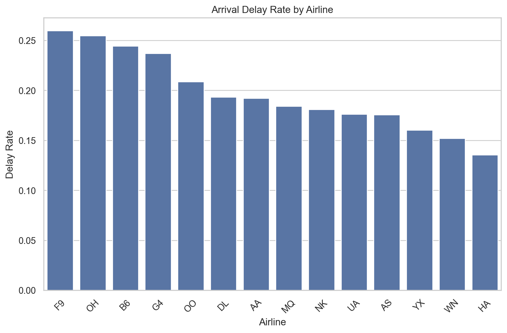
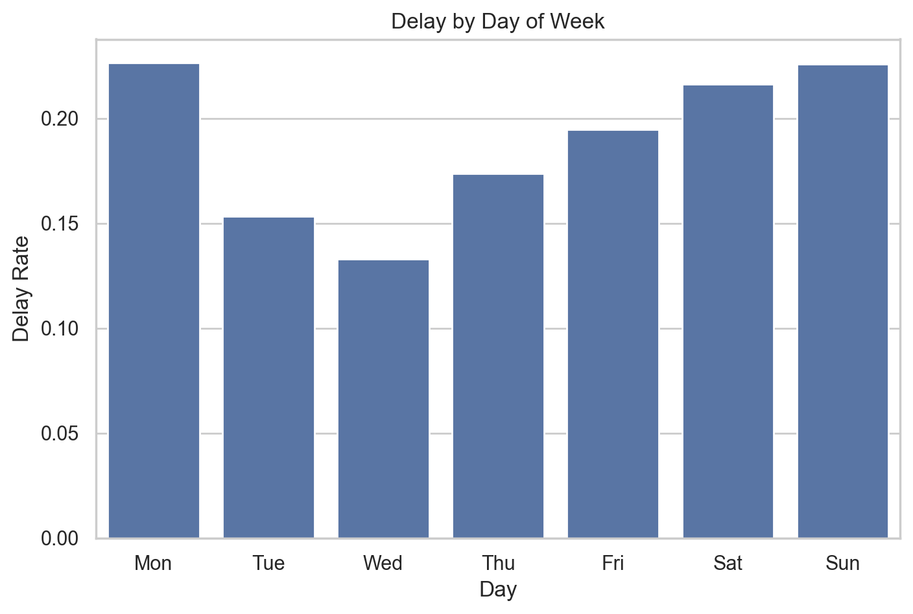
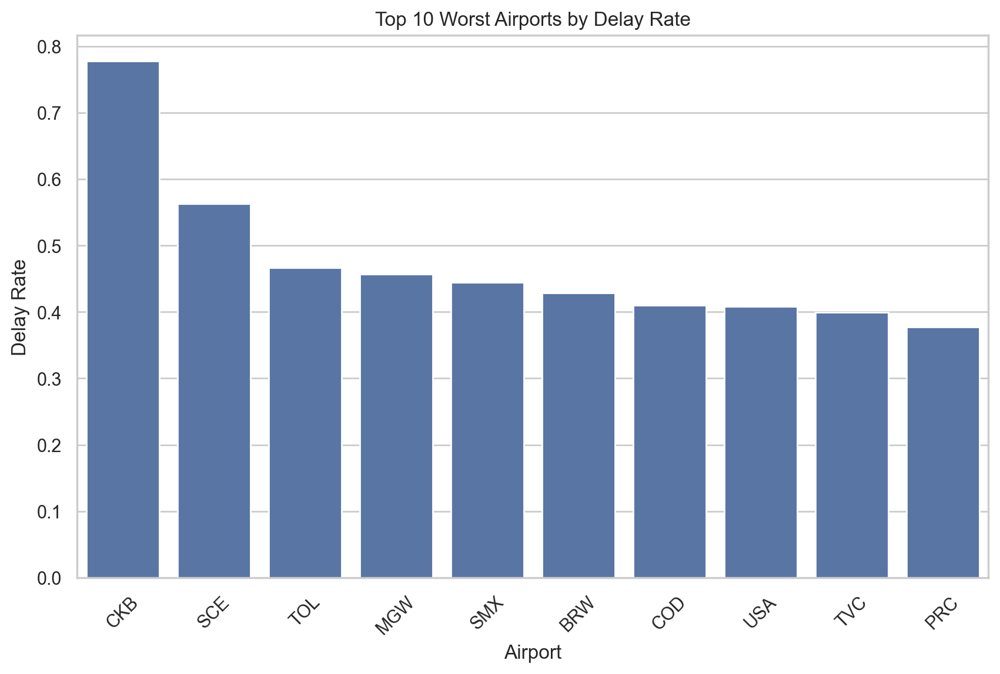

# ✈️ Flight Delay Analysis (BTS Data – January 2025)

## 📌 Overview

This project analyzes U.S. flight delay data to uncover patterns, identify key causes of delays, and highlight high-risk airports and time periods.

The goal is to move beyond simple reporting and provide **actionable insights** into airline operations and delay drivers.

---

## 📊 Dataset

* Source: Bureau of Transportation Statistics (BTS)
* Timeframe: January 2025
* Records include airline, origin/destination, delay indicators, and delay causes

---

## 🛠️ Tech Stack

* Python
* Pandas
* Matplotlib
* Seaborn

---

## 🔍 Key Analyses

The project explores:

* Overall delay rate across all flights
* Delay rate by airline
* Delay patterns by day of the week
* Root cause analysis of delays
* Top 10 worst airports by delay rate

---

## 📈 Key Insights

### 1. Carrier Delays Dominate

Contrary to expectations, **airline-related (carrier) delays** were the largest contributor to total delays.

This suggests that delays are often driven by:

* Operational inefficiencies
* Aircraft scheduling dependencies
* Cascading delays from earlier flights

---

### 2. Delays Are Systemic, Not Isolated

Delays often propagate throughout the day due to aircraft reuse across multiple routes.

> A single late flight can impact multiple downstream flights.

---

### 3. Day-of-Week Patterns Exist

Certain days consistently show higher delay rates, indicating potential scheduling or demand-related pressure points.

---

### 4. High-Risk Airports Identified

The analysis highlights the **top 10 airports with the highest delay rates**, which may reflect:

* Traffic congestion
* Operational complexity
* Network bottlenecks

---


## 📊 Sample Visualizations

### Arrival Delay Rate by Airline
<p align="center">
  
</p>

### Delay by Day of Week
<p align="center">
  
</p>

### Worst Airports by Delay Rate
<p align="center">
  
</p>
---

## 🚀 How to Run the Project

1. Clone the repository
2. Place the dataset in the `data/` folder
3. Run:

```bash
python main.py
```

4. Visualizations will be saved in the `visuals/` folder

---

## 📁 Project Structure

```
project/
│
├── data/
├── visuals/
├── src/
│   ├── data_loader.py
│   ├── preprocessing.py
│   ├── analysis.py
│   └── visualization.py
│
└── main.py
```

---

## 💡 Future Improvements

* Add interactive dashboard (e.g., Streamlit)
* Incorporate multiple months for trend analysis
* Build predictive model for delay probability

---

## 👤 Author

**Plamedi Diakubama**
Aspiring Data Analyst |M.S Data Analysis ( Concentration in Data Science), WGU 2025 

---

## 🎯 Summary

This project demonstrates the ability to:

* Clean and transform real-world data
* Perform exploratory and statistical analysis
* Extract meaningful business insights
* Communicate findings clearly through visualization

---
